

 
</a>

  

---

## 👨‍💻 About Me

I'm a **Cybersecurity and Digital Forensic Graduate** focused on **Cyber Threat Intelligence, OSINT, and security investigations**.

I enjoy turning raw security data into meaningful intelligence whether that starts with an IOC, suspicious domain, phishing email, malware hash, network capture, vulnerability, or threat report.
My focus is not simply on finding indicators, but on understanding the **context, behaviour, infrastructure, and potential impact** behind them.

---

##  GitHub Statistics

  

 

---

## 🏆 Certifications & Credentials

<table>
<tr>

<td align="center" width="25%">
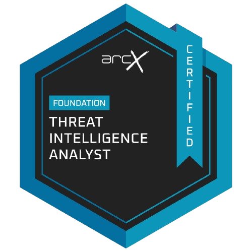  
<b>Foundation Threat Intelligence Analyst</b> 
arcX
</td>

<td align="center" width="25%">
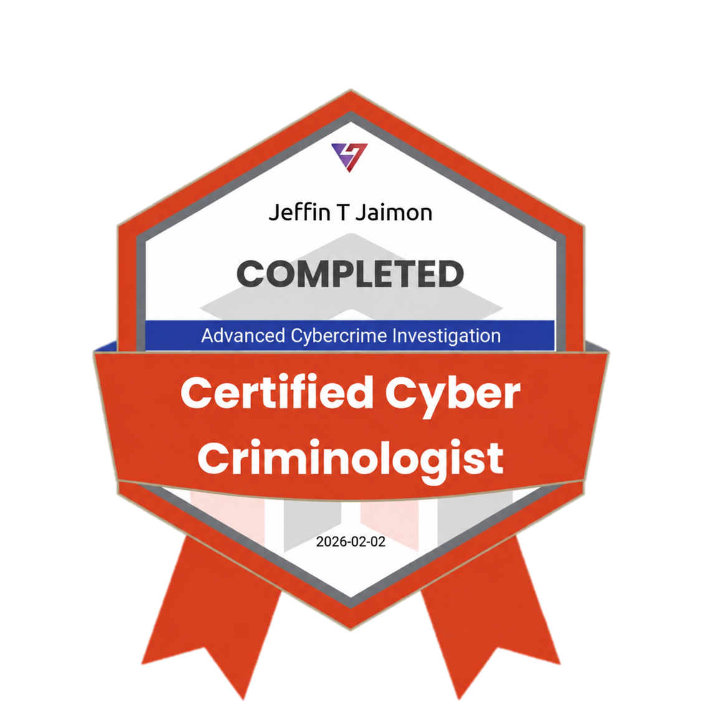  
<b>Certified Cyber Criminologist</b> 
Virtual Cyber Labs
</td>

<td align="center" width="25%">
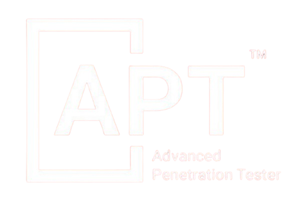  
<b>Advanced Penetration Tester</b> 
Red Team Hacker Academy
</td>

<td align="center" width="25%">
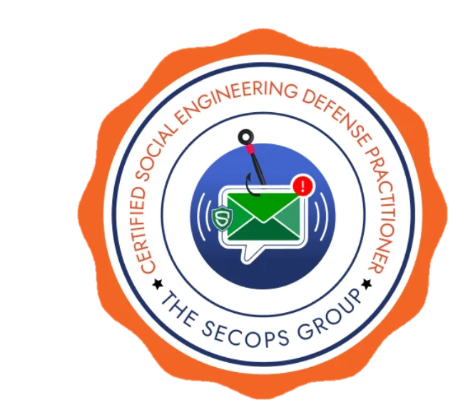  
<b>Social Engineering Defense Practitioner</b> 
The SecOps Group
</td>

</tr>

<tr>

<td align="center" width="25%">
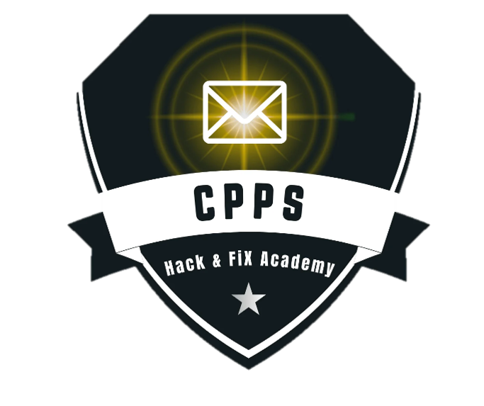  
<b>Phishing Prevention Specialist</b> 
Hack & Fix Academy
</td>

<td align="center" width="25%">
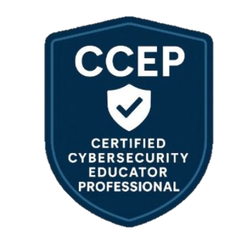  
<b>Cybersecurity Educator Professional</b> 
Red Team Leaders
</td>

<td align="center" width="25%">
  
<b>Certified Security Awareness 1</b> 
Mile2
</td>

<td align="center" width="25%">
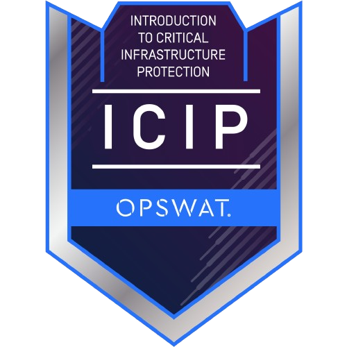  
<b>Introduction to Critical Infrastructure Protection</b> 
OPSWAT
</td>

</tr>

<tr>

<td align="center" width="25%">
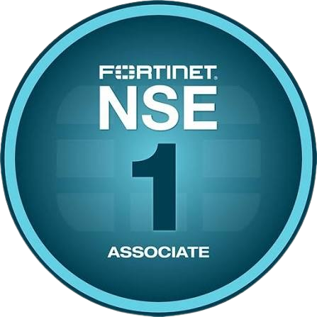  
<b>Network Security Expert 1</b> 
Fortinet
</td>

<td align="center" width="25%">
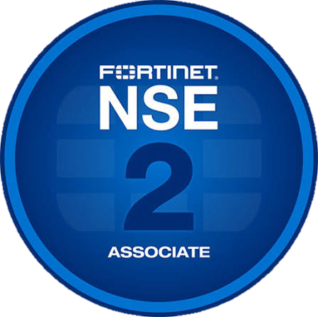  
<b>Network Security Expert 2</b> 
Fortinet
</td>

<td align="center" width="25%">
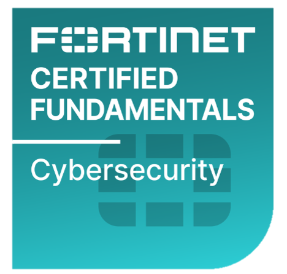  
<b>Fortinet Certified Fundamentals</b> 
Fortinet
</td>

<td align="center" width="25%">
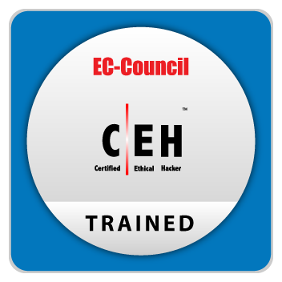  
<b>CEH Trained</b> 
EC-Council
</td>

</tr>
</table>

</td>

</tr>
</table>

